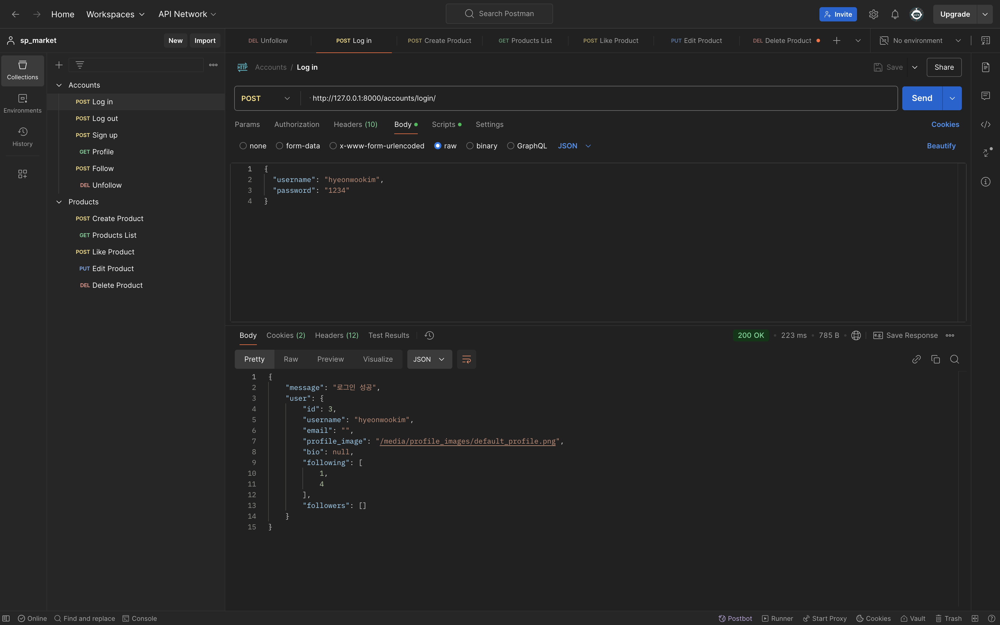
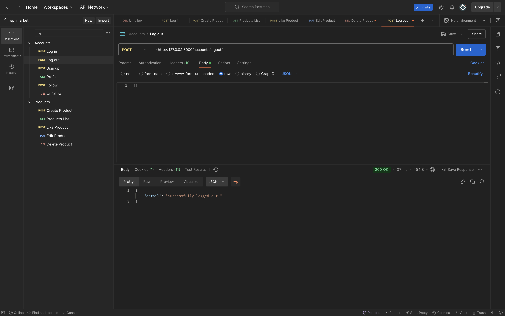
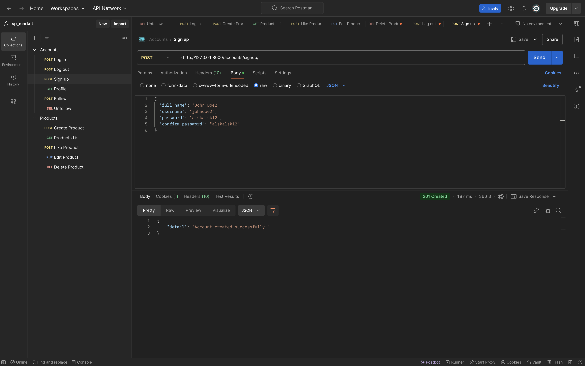
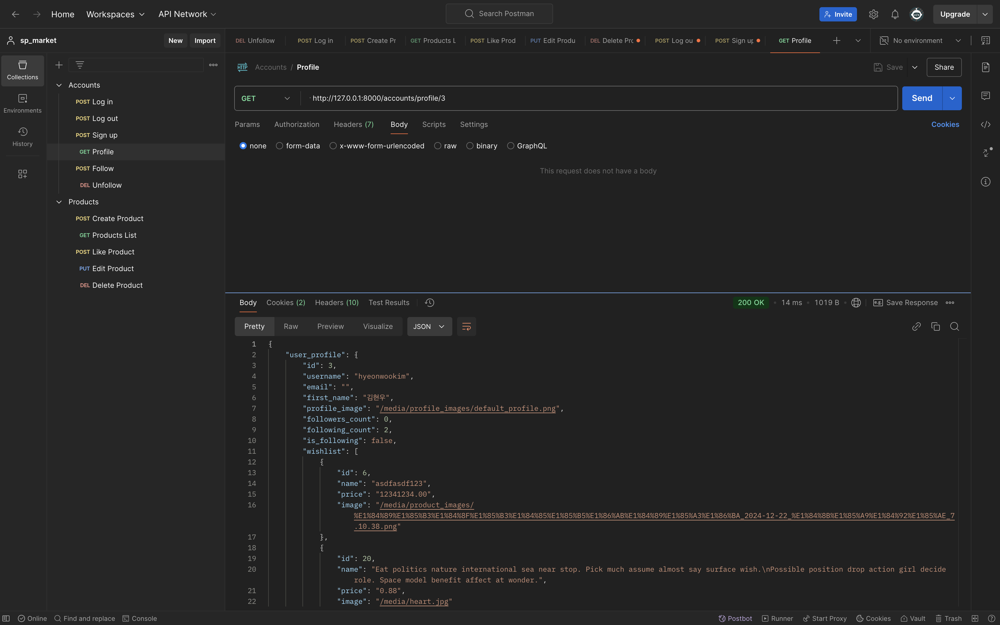
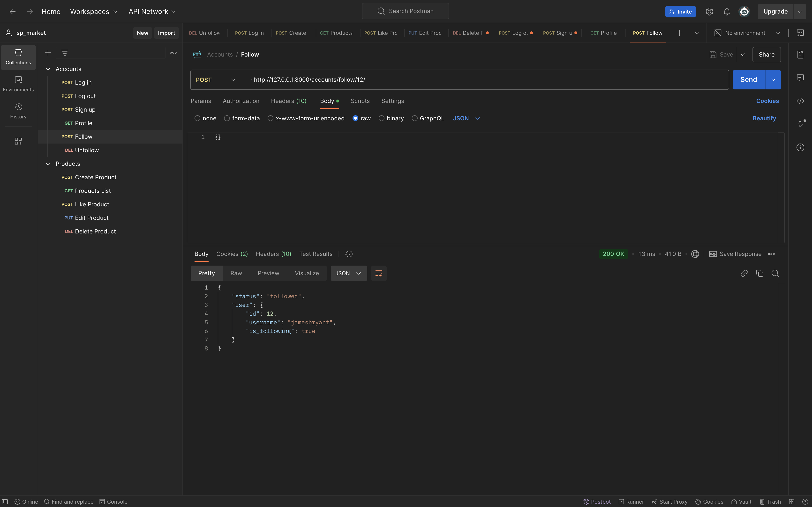
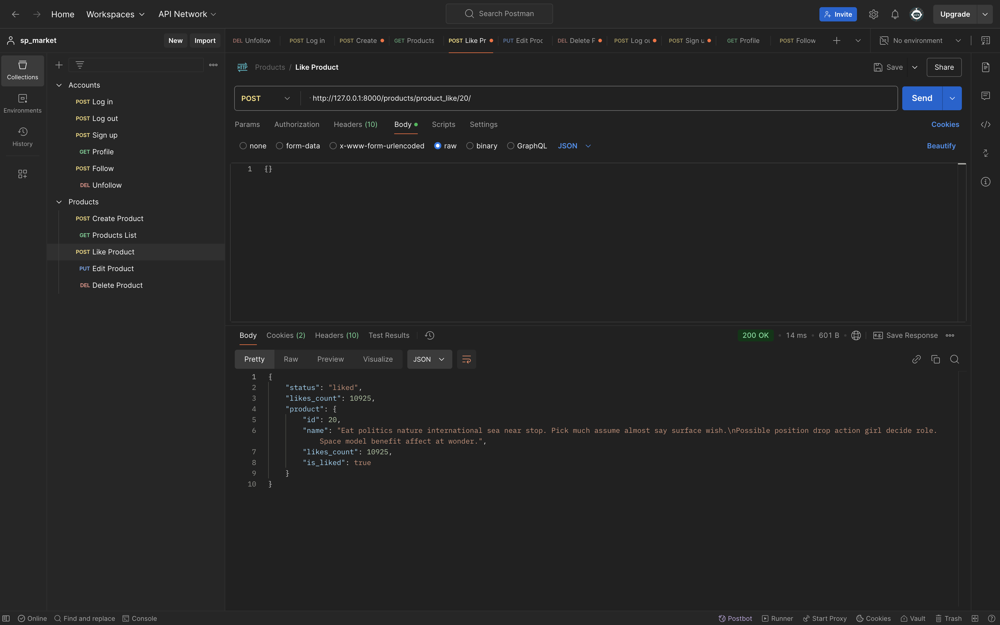
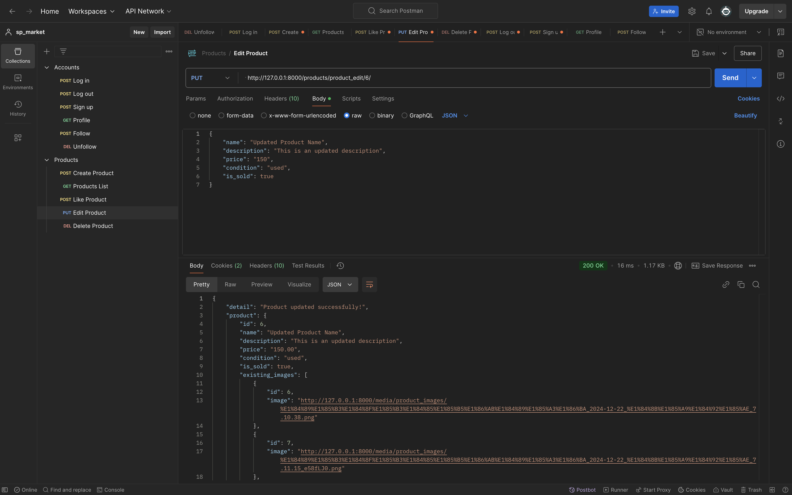
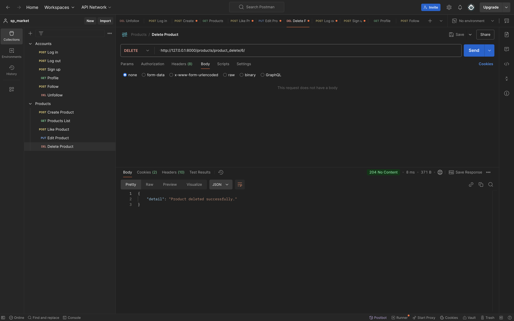

# 🛒 **Sparta Market – DRF (Django Rest Framework) 버전**

---

## 📖 **Overview**

- **Sparta Market (DRF 버전)**은 Django Rest Framework를 사용하여 구축된 **API 기반의 중고 거래 플랫폼**입니다.  
- 프론트엔드 없이 **JSON API**를 통해 데이터를 제공하며, 클라이언트는 REST API를 활용해 데이터를 송수신합니다.  
- 인증, 사용자 관리, 상품 관리, 찜하기, 팔로우 기능이 RESTful 엔드포인트를 통해 제공됩니다.

---

## 🛠️ **Tech Stack**

- **Backend:** Django, Django Rest Framework (DRF)  
- **Database:** SQLite
- **Authentication:** Token-based Authentication  

---

Sparta Market/
├── accounts/ # 사용자 인증 및 프로필 관리
│ ├── views.py
│ ├── models.py
│ ├── serializers.py
│ ├── urls.py
│ ├── templates/
├── products/ # 상품 관리 및 검색
│ ├── views.py
│ ├── models.py
│ ├── serializers.py
│ ├── urls.py
│ ├── templates/
├── static/ # CSS, JavaScript, 이미지 파일
│ ├── css/
│ ├── js/
├── templates/ # 공통 템플릿
│ ├── base.html
│ ├── home.html
├── db.sqlite3 # 데이터베이스 파일 (PostgreSQL 사용 권장)
├── manage.py # Django 명령어 관리 파일
└── README.md # 프로젝트 설명서

## 🧑‍💻 **1. Accounts API**

### ✅ **LOGIN**  
- **Method:** `POST`  
- **URL:** `/accounts/login/`  

### ✅ **LOGOUT**  
- **Method:** `POST`  
- **URL:** `/api/accounts/logout/`

  
  <!-- 왼쪽 이미지 -->
  

    <h4>로그인</h4>
    
  

  
  <!-- 오른쪽 이미지 -->
  

    <h4>로그아웃</h4>
    
  

  

### ✅ **SIGNUP**  
- **Method:** `POST`  
- **URL:** `/api/accounts/signup/`  

### ✅ **PROFILE**  
- **Method:** `GET`  
- **URL:** `/accounts/profile/<user_id>/` 

  
  <!-- 왼쪽 이미지 -->
  

    <h4>회원가입</h4>
    
  

  
  <!-- 오른쪽 이미지 -->
  

    <h4>프로필</h4>
    
  

  

### ✅ **FOLLOW**  
- **Method:** `POST`  
- **URL:** `/accounts/follow/<user_id>/`  

### ✅ **UNFOLLOW**  
- **Method:** `DELETE`  
- **URL:** `/accounts/unfollow/<user_id>/`  

  
  <!-- 왼쪽 이미지 -->
  

    <h4>팔로우</h4>
    
  

  
  <!-- 오른쪽 이미지 -->
  

    <h4>언팔로우</h4>
    
  

  

---

## 🧑‍💻 **2. Products API**

### ✅ **CREATE**  
- **Method:** `POST`  
- **URL:** `/products/product_create/`

### ✅ **LIST**  
- **Method:** `GET`  
- **URL:** `/products/product_list/`

  
  <!-- 왼쪽 이미지 -->
  

    <h4>물품 등록</h4>
    
  

  
  <!-- 오른쪽 이미지 -->
  

    <h4>물품 목록</h4>
    
  

  

### ✅ **LIKE**  
- **Method:** `POST`  
- **URL:** `/products/product_like/`

### ✅ **EDIT**  
- **Method:** `PUT`  
- **URL:** `/products/product_edit/<product_id>/`

  
  <!-- 왼쪽 이미지 -->
  

    <h4>물품 좋아요</h4>
    
  

  
  <!-- 오른쪽 이미지 -->
  

    <h4>물품 수정</h4>
    
  

  

### ✅ **DELETE**  
- **Method:** `DELETE`  
- **URL:** `/products/product_delete/<product_id>/`

    

      <h4>물품 삭제</h4>
    

